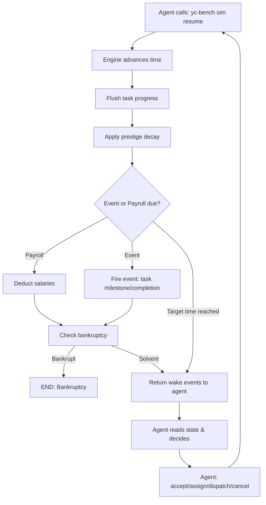

## Overview

YC-Bench is a **discrete-event simulation** where an LLM agent plays the CEO of an AI startup over 1–3 simulated years. The agent operates exclusively through a CLI tool (`yc-bench`) to manage tasks, employees, cash flow, and prestige across four technical domains.

The simulation tests long-horizon decision-making: prestige specialization, employee allocation, deadline management, and cash flow sustainability — sustained over hundreds of turns.

## Core Game Loop

The agent-simulation interaction follows a deterministic loop:



### Step-by-Step Breakdown

1. **Agent calls `sim resume`**: Advances simulation time to the next event (payroll boundary, task milestone, task completion, or explicit target time).

2. **Progress flushing**: The engine calculates work done by all active employees from `current_time` → `action_time` using their skill rates and assignment counts. See [Simulation Mechanics](/concepts/simulation-mechanics) for details.

3. **Prestige decay**: All four domains lose prestige daily at rate `prestige_decay_per_day`. Untouched domains drift back toward 1.0. See [Prestige System](/concepts/prestige-system#prestige-decay-mechanics).

4. **Event/Payroll dispatch**:
   - **Payroll** (1st of each month): deduct monthly salaries from company funds. If `funds < 0` after payroll, bankruptcy event is inserted.
   - **Event**: fire task progress milestones (25%, 50%, 75%) or task completion. Milestones give the agent visibility into employee productivity.

5. **Bankruptcy check**: If funds fall below zero, the simulation ends immediately.

6. **Wake events returned**: The agent receives a JSON payload describing what happened (e.g., `monthly_payroll`, `task_completed`).

7. **Agent decides**: The agent reads current state via `company status`, `task list`, `employee list`, etc., and issues commands to `accept`, `assign`, `dispatch`, or `cancel` tasks.

8. **Repeat**: The loop continues until a terminal condition is met.

## Terminal Conditions

The simulation ends when any of the following occurs:

- **Bankruptcy**: `company.funds_cents < 0` after payroll or any transaction.
- **Horizon end**: Simulation reaches the configured end date (1–3 years from start).
- **Max turns** (optional): Hard cap on agent actions if configured in the preset.

<Note>
  If the agent doesn't call `sim resume` for **10 consecutive turns**, the loop forces a time advance automatically to prevent stalls.
</Note>

## Turn Structure

### What Counts as a Turn?

Each agent action increments the turn counter. Relevant actions include:
- Accepting a task from the market
- Assigning an employee to a task
- Dispatching a task to active status
- Cancelling a task
- Calling `sim resume` to advance time
- Reading state (does NOT count as turn)

### Time Advancement

Time advances **only** when the agent calls `yc-bench sim resume`. The simulation is **event-driven** — the engine jumps to the next scheduled event (payroll, task milestone, task completion) or an explicit target time provided by the agent.

<Info>
  Time does **not** advance during agent thinking or between commands. The simulation is paused until `sim resume` is called.
</Info>

## Starting Conditions

Every run begins with:

- **Starting funds**: $80K–$250K depending on preset (default: $150K)
- **10 employees**: 5 junior, 3.5 mid-level, 1.5 senior (by share of headcount)
- **Prestige = 1.0** in all four domains (research, inference, data/environment, training)
- **200 market tasks**: Distributed across prestige levels and domain combinations
- **First payroll due**: Beginning of the second month

## CLI Tool Interface

The agent interacts with the simulation **exclusively** via `yc-bench` CLI commands, which return JSON output:

### Observation Commands

```bash
yc-bench company status           # funds, prestige levels, runway
yc-bench employee list            # tier, salary, active task count
yc-bench market browse            # available tasks by domain/prestige
yc-bench task list --status active # your tasks
yc-bench task inspect --task-id UUID
yc-bench finance ledger           # transaction history
yc-bench report monthly           # P&L summary
```

### Action Commands

```bash
yc-bench task accept --task-id UUID
yc-bench task assign --task-id UUID --employee-id UUID
yc-bench task dispatch --task-id UUID
yc-bench task cancel --task-id UUID --reason "..."
yc-bench sim resume               # advance time
yc-bench scratchpad write "..."  # persistent memory
```

<Warning>
  All commands return structured JSON. Agents must parse output to extract state. There is no "GUI" or direct state access.
</Warning>

## Key Design Principles

### Determinism

Given a fixed seed, employee pool, and task market, the simulation produces **identical results** for the same sequence of agent commands. This enables reproducible benchmarking.

### Per-Domain Prestige Gating

A task requiring domains `[research, training]` at prestige 5 checks **both** `company.prestige.research >= 5` AND `company.prestige.training >= 5`. This forces agents to maintain broad expertise rather than hyper-specializing in one domain.

See [Prestige System](/concepts/prestige-system#per-domain-gating) for details.

### Throughput Splitting

An employee assigned to **N active tasks** contributes `base_rate / N` to each task. Focus beats breadth: splitting an employee across 3 tasks reduces total throughput compared to working them sequentially.

See [Employee System](/concepts/employee-system#throughput-splitting) for the formula.

### Compounding Payroll Pressure

Every successful task completion gives all assigned employees a **1% salary bump**. This compounds over time, accelerating payroll costs. The agent must balance task completion rate with cash reserves.

See [Employee System](/concepts/employee-system#salary-bumps-on-task-completion-1-compounding) for details.

## What Makes This Benchmark Hard?

YC-Bench tests agent capabilities across multiple dimensions:

1. **Long-horizon planning**: Decisions made in month 1 affect survival in month 24.
2. **Compounding dynamics**: Prestige climbs, salaries compound, payroll pressure mounts.
3. **Multi-domain optimization**: Must maintain prestige across 4 domains to access high-value tasks.
4. **Hidden information**: Employee skill rates are unknown; must be inferred from task progress observations.
5. **Deadline risk**: Overcommitting employees → missed deadlines → prestige loss → market access restriction.
6. **Cash flow management**: Must balance payroll, runway, and reward timing.

<Info>
  Most tasks in the **medium** and **hard** presets require prestige 3–5 and work in 2 domains. Agents cannot rely on single-domain specialists.
</Info>

## Next Steps

<CardGroup cols={2}>
  <Card title="Simulation Mechanics" icon="gears" href="/concepts/simulation-mechanics">
    Learn how progress flushing, payroll, and event processing work under the hood.
  </Card>
  <Card title="Prestige System" icon="medal" href="/concepts/prestige-system">
    Understand prestige levels, decay, rewards, and per-domain gating.
  </Card>
  <Card title="Task Management" icon="list-check" href="/concepts/task-management">
    Explore task lifecycle: accept → assign → dispatch → complete/fail/cancel.
  </Card>
  <Card title="Employee System" icon="users" href="/concepts/employee-system">
    Understand tiers, hidden skill rates, throughput splitting, and salary bumps.
  </Card>
</CardGroup>
