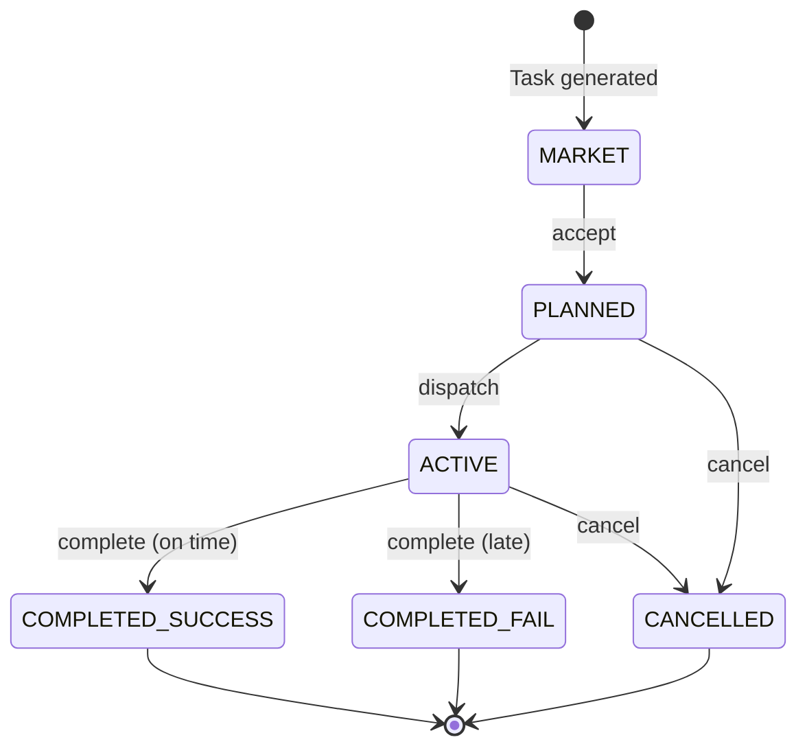

## Task Lifecycle

Tasks flow through six states (from `src/yc_bench/db/models/task.py:12`):

```python
class TaskStatus(str, Enum):
    MARKET = "market"                      # Available for acceptance
    PLANNED = "planned"                    # Accepted, not yet dispatched
    ACTIVE = "active"                      # Work in progress
    COMPLETED_SUCCESS = "completed_success" # Finished on time
    COMPLETED_FAIL = "completed_fail"       # Finished late
    CANCELLED = "cancelled"                 # Cancelled by agent
```

### State Transition Diagram



## Market Phase

Tasks start in the **market** — a pool of 200 available tasks (configurable).

### Browsing the Market

```bash
yc-bench market browse --domain research --limit 20
```

**Example output**:

```json
{
  "count": 20,
  "tasks": [
    {
      "task_id": "a1b2c3d4-...",
      "title": "Implement sparse attention mechanism",
      "required_prestige": 5,
      "reward_funds_cents": 4480000,  // $44,800
      "reward_prestige_delta": 0.12,
      "domains": ["research", "training"],
      "requirements": {
        "research": 3200,
        "training": 1800
      }
    },
    ...
  ]
}
```

### Market Replenishment (from `src/yc_bench/cli/task_commands.py:85`)

When you accept a task, the market **immediately** generates a replacement task with similar prestige:

```python
replacement = generate_replacement_task(
    run_seed=sim_state.run_seed,
    replenish_counter=counter,  # Ensures determinism
    replaced_prestige=task.required_prestige,
    cfg=world_config,
)
```

The market size stays constant at 200 tasks (default) throughout the run.

<Info>
  Market replenishment is **deterministic** — given the same seed and acceptance sequence, the market evolves identically across runs.
</Info>

## Acceptance (market → planned)

### Command

```bash
yc-bench task accept --task-id <UUID>
```

### Acceptance Checks (from `src/yc_bench/cli/task_commands.py:60`)

1. **Prestige gating**: For each domain the task requires, verify `company.prestige[domain] >= task.required_prestige`

```python
for req in task.requirements:
    domain_prestige = company.prestige[req.domain]
    if task.required_prestige > domain_prestige:
        raise PrestigeError(f"Insufficient prestige in {req.domain}")
```

2. **Deadline calculation**: Based on the **heaviest single domain** (domains work in parallel)

```python
max_domain_qty = max(req.required_qty for req in task.requirements)
biz_days = max(
    deadline_min_biz_days,  # 7 days (default)
    int(max_domain_qty / deadline_qty_per_day)  # 200 units/day (default)
)
deadline = add_business_hours(accepted_at, biz_days * work_hours_per_day)
```

3. **Task transition**: `status = PLANNED`, `company_id = your_company`, `accepted_at = sim_time`

### Acceptance Output

```json
{
  "task_id": "a1b2c3d4-...",
  "status": "planned",
  "accepted_at": "2025-03-15T10:00:00Z",
  "deadline": "2025-03-29T18:00:00Z",  // 10 business days
  "replacement_task_id": "e5f6g7h8-..."  // New market task
}
```

<Warning>
  Accepting a task is **irreversible** (except via cancellation, which incurs a 2× prestige penalty). Do not accept tasks speculatively.
</Warning>

## Assignment (planned/active + employee)

### Command

```bash
yc-bench task assign --task-id <UUID> --employee-id <UUID>
```

### Assignment Rules (from `src/yc_bench/cli/task_commands.py:136`)

- Task must be in `PLANNED` or `ACTIVE` status
- Employee must belong to your company
- Cannot assign the same employee twice to the same task
- No limit on employees per task (but throughput splits!)

### Assignment Effects

1. **Record assignment** in `task_assignments` table
2. **Recalculate ETAs** if task is already active (employee's throughput is now split)

```python
if task.status == ACTIVE:
    # Find all active tasks this employee is assigned to
    impacted_tasks = get_active_tasks_for_employee(employee_id)
    recalculate_etas(db, company_id, sim_time, impacted_tasks)
```

### Assignment Output

```json
{
  "task_id": "a1b2c3d4-...",
  "status": "planned",
  "assignments": [
    {
      "employee_id": "emp1-...",
      "assigned_at": "2025-03-15T10:05:00Z"
    },
    {
      "employee_id": "emp2-...",
      "assigned_at": "2025-03-15T10:06:00Z"
    }
  ]
}
```

<Info>
  You can assign employees **before** or **after** dispatching. Assigning before dispatch allows you to validate team composition before work begins.
</Info>

## Dispatch (planned → active)

### Command

```bash
yc-bench task dispatch --task-id <UUID>
```

### Dispatch Rules (from `src/yc_bench/cli/task_commands.py:208`)

- Task must be in `PLANNED` status
- Task must have **at least one assignment**

```python
if assignment_count == 0:
    raise ValidationError("Task has no assignments. Assign employees first.")
```

### Dispatch Effects (from `src/yc_bench/cli/task_commands.py:239`)

1. **Transition to active**: `task.status = ACTIVE`
2. **Recalculate ETAs**: Schedule `TASK_HALF_PROGRESS` and `TASK_COMPLETED` events
3. **Recalculate peer tasks**: Other active tasks sharing assigned employees get updated ETAs

```python
# Find all active tasks that share employees with this task
impacted = {task_id}  # Include this task
for assignment in task.assignments:
    for peer_task in get_active_tasks_for_employee(assignment.employee_id):
        impacted.add(peer_task.id)

recalculate_etas(db, company_id, sim_time, impacted)
```

### Dispatch Output

```json
{
  "task_id": "a1b2c3d4-...",
  "status": "active",
  "assignment_count": 2
}
```

<Note>
  Once dispatched, work begins **immediately**. Progress accumulates during the next `sim resume` call.
</Note>

## Progress Checkpoints (25%, 50%, 75%, 100%)

The agent is woken at progress milestones to observe task advancement.

### Default Milestones (from `default.toml:97`)

```toml
task_progress_milestones = [0.25, 0.5, 0.75]
```

- **25%**: Early checkpoint — verify employees are working
- **50%**: Halfway — reassess deadline risk
- **75%**: Final checkpoint before completion
- **100%**: Task completed (handled separately)

### Milestone Event (from `src/yc_bench/core/handlers/task_half.py:20`)

When a milestone fires:

```python
def handle_task_half(db, event):
    task_id = event.payload["task_id"]
    milestone_pct = event.payload["milestone_pct"]  # 25, 50, or 75
    
    task.progress_milestone_pct = max(
        task.progress_milestone_pct,
        milestone_pct
    )
    
    # Recalculate ETAs to schedule the next milestone
    recalculate_etas(db, company_id, sim_time)
```

### Observing Progress

Agents can query task progress:

```bash
yc-bench task inspect --task-id <UUID>
```

**Example output**:

```json
{
  "task_id": "a1b2c3d4-...",
  "status": "active",
  "progress_pct": 52.3,
  "requirements": [
    {
      "domain": "research",
      "required_qty": 3200,
      "completed_qty": 1680,
      "remaining_qty": 1520
    },
    {
      "domain": "training",
      "required_qty": 1800,
      "completed_qty": 945,
      "remaining_qty": 855
    }
  ],
  "assignments": [...]
}
```

<Info>
  Progress milestones provide **data points** to infer employee productivity. Agents can measure `actual_progress / expected_progress` to estimate hidden skill rates.
</Info>

## Deadline Calculation

Deadlines are computed at acceptance time based on the **heaviest single domain** (from `src/yc_bench/cli/task_commands.py:30`).

### Formula

```python
max_domain_qty = max(req.required_qty for req in task.requirements)
biz_days = max(
    deadline_min_biz_days,      # 7 (default)
    max_domain_qty / deadline_qty_per_day  # 200 units/day (default)
)
deadline = add_business_hours(accepted_at, biz_days * work_hours_per_day)
```

### Deadline Parameters (from `default.toml:93`)

```toml
deadline_qty_per_day = 200.0
deadline_min_biz_days = 7
```

### Example

Task requirements:
- Research: 3200 units
- Training: 1800 units

**Max domain qty**: `3200` (research)

**Biz days**: `max(7, 3200 / 200) = max(7, 16) = 16` days

**Work hours**: `16 days × 9 hours/day = 144 business hours`

**Deadline**: `accepted_at + 144 business hours`

<Warning>
  Deadlines are based on **default throughput assumptions** (200 units/day). If your employees are slower than expected, you **will** miss deadlines. Agents must measure actual throughput and plan accordingly.
</Warning>

## Task Completion (100% progress)

When all domain requirements reach `completed_qty >= required_qty`, a `TASK_COMPLETED` event fires.

### Success vs. Failure (from `src/yc_bench/core/handlers/task_complete.py:47`)

```python
success = (completion_time <= task.deadline)
```

- **Success**: `completion_time ≤ deadline`
- **Failure**: `completion_time > deadline`

### Success Outcome (from `src/yc_bench/core/handlers/task_complete.py:54`)

```python
if success:
    task.status = COMPLETED_SUCCESS
    
    # 1. Add reward funds
    company.funds_cents += task.reward_funds_cents
    
    # 2. Add prestige to each required domain
    for domain in task.requirements:
        company.prestige[domain] = min(
            prestige_max,
            company.prestige[domain] + task.reward_prestige_delta
        )
    
    # 3. Skill boost assigned employees (in task's domains)
    for assignment in task.assignments:
        for domain in task.requirements:
            employee.skill_rate[domain] *= (1 + task.skill_boost_pct)
    
    # 4. Salary bump for assigned employees
    for assignment in task.assignments:
        employee.salary_cents *= (1 + salary_bump_pct)  # +1% (default)
```

### Failure Outcome (from `src/yc_bench/core/handlers/task_complete.py:110`)

```python
if not success:
    task.status = COMPLETED_FAIL
    
    # Apply prestige penalty (1.4× reward delta)
    penalty = penalty_fail_multiplier * task.reward_prestige_delta
    for domain in task.requirements:
        company.prestige[domain] = max(
            prestige_min,
            company.prestige[domain] - penalty
        )
    
    # No funds awarded
    # No skill boost
    # No salary bump
```

<Warning>
  Failing a task means:
  - ❌ No funds awarded (you still paid payroll while working on it)
  - ❌ Prestige penalty (1.4× the reward delta)
  - ❌ No skill boost or salary bump
  - ⚠️ Wasted employee time that could have been spent on other tasks
</Warning>

## Cancellation

Agents can cancel planned or active tasks, but at a steep cost.

### Command

```bash
yc-bench task cancel --task-id <UUID> --reason "Deadline at risk"
```

### Cancellation Rules (from `src/yc_bench/cli/task_commands.py:372`)

- Task must be in `PLANNED` or `ACTIVE` status
- Cannot cancel completed tasks

### Cancellation Effects (from `src/yc_bench/cli/task_commands.py:397`)

```python
# 1. Apply prestige penalty (2× reward delta)
penalty = penalty_cancel_multiplier * task.reward_prestige_delta
for domain in task.requirements:
    company.prestige[domain] = max(
        prestige_min,
        company.prestige[domain] - penalty
    )

# 2. Set status to CANCELLED
task.status = CANCELLED

# 3. Drop pending events
for event in get_events_for_task(task_id):
    event.consumed = True

# 4. Recalculate ETAs for tasks sharing freed employees
impacted_tasks = get_active_tasks_sharing_employees(task.assignments)
recalculate_etas(db, company_id, sim_time, impacted_tasks)
```

### Cancellation Penalties (from `default.toml:74`)

```toml
penalty_cancel_multiplier = 2.0  # 2× the reward delta
```

**Example**:
- Task reward: `+0.10` prestige per domain
- Cancel penalty: `-0.20` prestige per domain

<Warning>
  Cancelling is **worse** than failing:
  - **Failure**: `-1.4×` reward delta (completed late)
  - **Cancellation**: `-2.0×` reward delta (gave up)
  
  Accepting a task is a real commitment. Do not accept speculatively.
</Warning>

## Success vs. Failure vs. Cancellation Summary

| Outcome | Prestige Change | Funds | Skill Boost | Salary Bump | Notes |
|---------|-----------------|-------|-------------|-------------|-------|
| **Success** | `+reward_prestige_delta` | `+reward_funds_cents` | ✅ Yes | ✅ +1% | On-time completion |
| **Failure** | `-1.4× reward_prestige_delta` | ❌ None | ❌ None | ❌ None | Late completion |
| **Cancellation** | `-2.0× reward_prestige_delta` | ❌ None | ❌ None | ❌ None | Gave up early |

## Task Observability

Agents can inspect tasks at any time:

### List All Tasks

```bash
yc-bench task list --status active
```

**Output**:

```json
{
  "count": 3,
  "tasks": [
    {
      "task_id": "a1b2c3d4-...",
      "title": "Implement sparse attention",
      "status": "active",
      "progress_pct": 52.3,
      "deadline": "2025-03-29T18:00:00Z",
      "at_risk": false
    },
    ...
  ]
}
```

### Inspect Task Details

```bash
yc-bench task inspect --task-id <UUID>
```

**Output**:

```json
{
  "task_id": "a1b2c3d4-...",
  "title": "Implement sparse attention",
  "status": "active",
  "required_prestige": 5,
  "reward_funds_cents": 4480000,
  "reward_prestige_delta": 0.12,
  "skill_boost_pct": 0.15,
  "accepted_at": "2025-03-15T10:00:00Z",
  "deadline": "2025-03-29T18:00:00Z",
  "progress_pct": 52.3,
  "requirements": [
    {
      "domain": "research",
      "required_qty": 3200,
      "completed_qty": 1680,
      "remaining_qty": 1520
    },
    {
      "domain": "training",
      "required_qty": 1800,
      "completed_qty": 945,
      "remaining_qty": 855
    }
  ],
  "assignments": [
    {
      "employee_id": "emp1-...",
      "employee_name": "Alice",
      "assigned_at": "2025-03-15T10:05:00Z"
    }
  ]
}
```

## Best Practices

### 1. Validate Prestige Before Accepting

Check `company status` to ensure you meet prestige requirements in **all** required domains:

```python
for domain in task.requirements:
    if company.prestige[domain] < task.required_prestige:
        # Do not accept — prestige gating will fail
```

### 2. Assign Sufficient Employees

Deadlines assume ~200 units/day throughput. If your employees average 5 units/hour:

```
required_hours = max_domain_qty / (num_employees × avg_rate)
biz_days = required_hours / 9  # 9 hours/day
```

Ensure `biz_days <= deadline_biz_days`.

### 3. Monitor Progress Milestones

Compare actual progress at 25%, 50%, 75% checkpoints to expected progress. If behind, add more employees or cancel before it's too late.

### 4. Avoid Throughput Splitting

Assigning an employee to 3 tasks simultaneously reduces their per-task throughput by 3×. Prefer sequential task assignments.

### 5. Cancel Strategically

If a task is clearly doomed (e.g., 40% complete at 75% of deadline), cancelling **before** completion minimizes prestige loss compared to letting it fail.

<Info>
  Cancellation penalty (`-2.0×`) is applied immediately. Failure penalty (`-1.4×`) is applied at completion. If you cancel early, you lose less prestige than if you let it run to a late completion.
</Info>

## Next Steps

<CardGroup cols={2}>
  <Card title="Employee System" icon="users" href="/concepts/employee-system">
    Learn how employees contribute to tasks and how throughput splitting works.
  </Card>
  <Card title="Prestige System" icon="medal" href="/concepts/prestige-system">
    Understand prestige rewards, penalties, and per-domain gating.
  </Card>
  <Card title="Scoring" icon="chart-line" href="/concepts/scoring">
    Learn how task outcomes factor into final benchmark scores.
  </Card>
  <Card title="Simulation Mechanics" icon="gears" href="/concepts/simulation-mechanics">
    Deep dive into progress flushing and ETA calculation.
  </Card>
</CardGroup>
